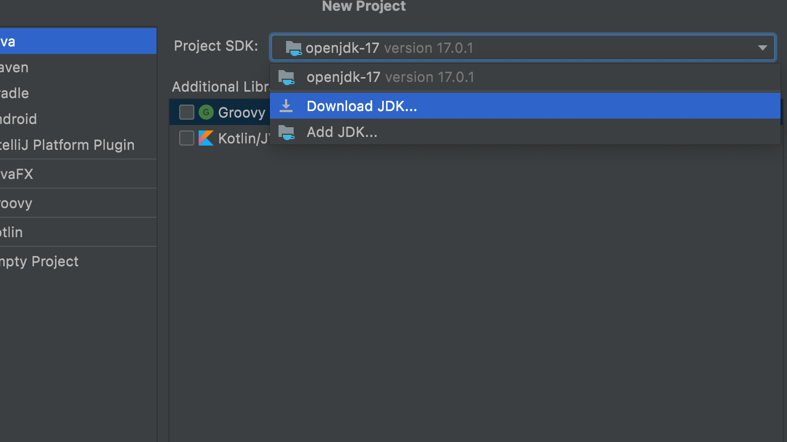

# Installation Guide for IntelliJ IDEA

* Download IntelliJ IDEA from this [link](https://www.jetbrains.com/idea/download/#section=mac)

* Create New project 

* Choose Java 

* Download JDK like the following

 
 

 * After the JDK Download press next then check create project from template 

 

 * Then press next and write your project name and finish 

 

